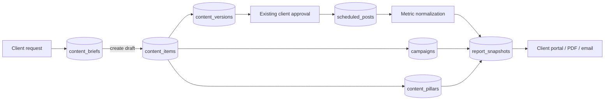

# Agency growth features: implementation plan

## Status and goal

First implementation added locally; database rollout and live integration verification are pending. This document covers three connected features:

1. Client content requests and briefs.
2. Campaigns and content pillars.
3. Automated client reports.

The common workflow is: **client brief → agency content item → campaign and pillar → approval and publishing → monthly report**. All records belong to one workspace. Existing portal content, scheduling, approval, brand settings, and delivery reporting remain the foundation.

## Existing system to build on

### Implementation and rollout notes (2026-09-24)

- Implemented Requests with assignment, revision checks, shared/internal discussion, change history, private attachments, and linked draft creation.
- Implemented campaign/pillar catalogs, legacy campaign backfill, draft selectors, calendar filters, and campaign progress.
- Implemented report schedules, idempotent monthly snapshots, leased worker claims, capped retries, available provider metrics, campaign/pillar summaries, and private PDF downloads.
- Apply `supabase/migrations/20260924140000_agency_growth.sql` after the existing client portal migration, first in staging. The migration has not been applied or executed against Postgres locally. It creates the private `agency-private` bucket; server service-role storage access is required.
- Install dependencies and restart the server after applying the migration. The report worker runs within the server process every minute; an always-running backend is required. Enable automation under Reports. It generates the previous month on or after the configured local day; it does not backfill missed earlier months automatically.
- Reports use scheduled-time month membership and lifetime engagement collected at generation. Missing metrics remain unavailable. Existing ready snapshots are immutable; Generate returns the existing snapshot for that workspace/month. Failed snapshots can be retried.
- Configure `REPORT_FONT_PATH` to an installed Unicode-capable font file for non-Latin PDF content; the default PDF font has limited character coverage.
- Remaining enhancements from the broader plan: unread indicators, campaign KPI targets, pillar ordering, approval-turnaround metrics, report revision/regeneration history, and email recipients/delivery tracking. No email is sent. Brief/campaign date inputs currently explicitly use UTC dates; report month boundaries use the chosen timezone.
- Verification: focused model/permission/PDF tests, frontend lint, server syntax checks, and Vite production build. Live provider calls, Supabase RLS/worker concurrency, and browser interaction require staging verification before production rollout.

- `content_items` holds editorial posts, versions, client review state, `planned_for`, and a free-text `campaign_name`.
- `scheduled_posts` holds actual delivery state and links back to approved content items.
- `/api/reports/summary` returns bounded delivery totals and recent posts for one workspace; it does not yet produce engagement metrics or a durable report.
- `workspace_brand_profiles` stores client identity and report footer.
- The client portal has calendar, content review, reports, and agency settings screens.
- Workspace roles are `owner`, `admin`, `member`, and `client`; server capability checks enforce access.

Do not change a migration already applied in an environment. Add a new additive migration for the tables and columns below.

## Architecture



The brief and post are separate records: one request can lead to multiple posts. Campaigns and pillars classify posts without changing the publishing workflow. A report is a stored snapshot so a PDF and client portal view show the same figures even if provider metrics later change.

## 1. Client content requests and briefs

### User flow

1. A client opens **Requests** in the portal and submits a title, goal, desired channels, deadline, instructions, and optional links or files.
2. An agency member sees a new request, assigns an owner, asks questions in a shared thread, and marks it `in_progress`.
3. The agency creates one or more `content_items` from the brief. The brief remains linked to each draft.
4. When deliverables are published, the agency marks the brief complete. A withdrawn request is marked cancelled, preserving its history.

Use the workspace timezone for displayed dates; store all deadlines as `timestamptz`.

### Data

Create `content_briefs`:

| Field | Purpose |
| --- | --- |
| `id`, `workspace_id`, `created_by`, timestamps | Identity, tenant scope, author, audit |
| `title`, `objective`, `instructions`, `reference_urls` | Client request details |
| `requested_channels`, `desired_publish_at`, `due_at` | Planning details; dates may be null |
| `status` | `submitted`, `needs_info`, `in_progress`, `completed`, `cancelled` |
| `assigned_to` | Agency owner, nullable |

Create `brief_attachments` with `workspace_id`, `brief_id`, uploader, object key, filename, MIME type, size, and created time. Store files using the existing storage abstraction, with workspace-prefixed keys and signed access where needed. A client should upload only to their workspace. Reject unsupported types and enforce a file count and size limit.

Create `brief_comments` with author, body, timestamp, and `visibility = shared | internal`; client readers must never receive internal notes. Add nullable `content_items.brief_id` so a brief can produce many posts. Index briefs by `(workspace_id, status, created_at DESC)` and comments by `(brief_id, created_at)`.

### API and permissions

Mount `/api/briefs` after authentication and workspace resolution:

```text
GET    /api/briefs?status=&cursor=
POST   /api/briefs
GET    /api/briefs/:id
PATCH  /api/briefs/:id
POST   /api/briefs/:id/comments
POST   /api/briefs/:id/attachments
POST   /api/briefs/:id/create-content
```

Clients can create and view briefs and add shared comments. They can edit or cancel their own brief only while it is `submitted` or `needs_info`. Agency roles can assign, change status, add internal notes, and create content. The server validates the role, workspace, attachment ownership, and every linked `content_item` ID. Keep an append-only `brief_events` log of assignment and state changes.

Add `/api/briefs` to the client-role module allowlist in `server/src/middleware/workspace.js`, then apply explicit capability checks per operation. RLS permits workspace-scoped reads; writes go through the server.

### UI

Add **Requests** to the portal navigation. Client view: request list, status, new request form, attachments, and discussion. Agency view: request inbox with status/assignee filters, detail panel, **Create draft** action, and links to resulting content. Show unread comments and due dates.

## 2. Campaigns and content pillars

### Definitions

- **Campaign:** A time-bound initiative such as “October launch,” with a goal, start/end dates, and optional KPI target.
- **Content pillar:** A reusable theme such as “Customer stories” or “Education” used across campaigns.

One post belongs to at most one campaign in the first release and has one primary pillar. This keeps filtering and reporting clear. Multi-tagging can be added later if clients need it.

### Data and migration

Create `campaigns` with `id`, `workspace_id`, `name`, `objective`, `starts_at`, `ends_at`, `status`, `target_metric`, `target_value`, `created_by`, and timestamps. Create `content_pillars` with `id`, `workspace_id`, `name`, `description`, `color`, `sort_order`, `is_active`, and timestamps. Add nullable `content_items.campaign_id` and `content_items.pillar_id`.

Backfill distinct nonblank `(workspace_id, campaign_name)` values to `campaigns`, link matching `content_items`, then retire writes to `campaign_name`. Keep the old column temporarily for compatibility; remove it only after all deployed code reads IDs. Use a unique index on `(workspace_id, lower(name))` for each catalog and indexes on `content_items(workspace_id, campaign_id, planned_for)` and `(workspace_id, pillar_id, planned_for)`.

Foreign keys alone cannot guarantee that a post and its campaign belong to the same workspace. Enforce this with composite `(workspace_id, id)` references or an equivalent database constraint, and verify it again at the API boundary.

### API and UI

```text
GET/POST    /api/campaigns
GET/PATCH   /api/campaigns/:id
GET        /api/campaigns/:id/posts
GET/POST    /api/pillars
PATCH       /api/pillars/:id
```

Agency members can create and edit campaigns and pillars; clients can read them. In the draft form, choose an existing campaign and pillar rather than typing a campaign name. Add campaign/pillar filters to the calendar and request list, and show campaign progress: planned, awaiting approval, scheduled, published, and failed. Preserve historical posts when a campaign closes or a pillar becomes inactive.

If a brief names a campaign, carry that selection into the resulting draft. Do not automatically schedule a post because it belongs to a campaign.

## 3. Automated client reports

### Report definition

The first scheduled report is monthly per workspace, for the previous calendar month in that workspace's timezone. It includes:

- Publishing totals: planned, published, failed, and approval turnaround.
- Available per-platform engagement: likes, comments, shares, views/impressions where the provider actually returns them.
- Top posts and campaign/pillar breakdowns.
- Agency-authored narrative: wins, lessons, next steps.
- Data coverage notes when a metric or platform is unavailable.

Do not present a missing metric as zero. The current `/api/reports/summary` has delivery counts only, so engagement collection and normalization must be implemented before the report claims engagement performance.

### Data

Create `report_schedules`: `workspace_id` unique, `enabled`, `day_of_month`, `timezone`, `recipient_user_ids`, `delivery_channel`, `last_period_end`, `next_run_at`, and timestamps. Start with portal availability plus email delivery only when a configured mail provider exists; never mark an email delivered if no sender is configured.

Create `report_snapshots`: `id`, `workspace_id`, `period_start`, `period_end`, `status`, `schema_version`, `metrics` JSONB, `narrative` JSONB, `brand_snapshot` JSONB, `generated_at`, `pdf_object_key`, `error_message`, and timestamps. Enforce unique `(workspace_id, period_start, period_end)` and an index on `(workspace_id, period_end DESC)`.

Create `report_deliveries`: snapshot ID, recipient ID or address, channel, status, attempt count, sent time, and error. Use a unique delivery key to prevent duplicate monthly emails.

### Metric collection and scheduling

Add a report service that reads workspace-filtered `scheduled_posts` and linked `content_items`, fetches provider metrics through existing Meta/LinkedIn services, and normalizes values into a versioned report DTO. Page through the entire selected month; the current `limit(1000)` is not enough for a complete agency report. Record a collection timestamp and unavailable fields per platform.

Run a daily scheduler sweep, claim due schedule rows atomically, and generate the previous complete month. Use the `(workspace_id, period_start, period_end)` uniqueness constraint for idempotent retries. Generate a PDF from the stored snapshot, save it to private storage, and expose authenticated downloads. Email recipients only after the snapshot and PDF are ready. Retry transient failures with a cap and retain a visible failed status for agency staff.

An agency user can regenerate a report to intentionally refresh metrics; this creates a new revision or explicitly replaces the current snapshot with audit history. A client cannot edit a generated report.

### API and UI

```text
GET  /api/reports/schedule
PUT  /api/reports/schedule                 agency admin/owner
GET  /api/reports/snapshots?cursor=
GET  /api/reports/snapshots/:id
GET  /api/reports/snapshots/:id/download
POST /api/reports/snapshots/generate      agency admin/owner
```

Add report settings under **Clients & brand**: monthly cadence, recipients, and agency narrative defaults. The Reports screen shows the latest snapshot, campaign/pillar breakdowns, generation status, PDF download, and any data coverage caveats. Clients can view and download reports for their workspace.

## Delivery order

1. **Brief foundation:** migration, attachments, state transitions, APIs, and client/agency request screens.
2. **Campaign foundation:** normalized campaign/pillar tables, safe backfill, catalog APIs, form selectors, and calendar filters.
3. **Metric layer:** provider normalization, complete period pagination, campaign/pillar aggregation, and data coverage rules.
4. **Report automation:** schedules, snapshots, private PDFs, delivery attempts, portal settings, and email integration when configured.

The three slices can ship independently. Briefs can link to existing content before campaign selectors exist; reports can initially show delivery-only snapshots labeled as such while the metric layer is completed.

## Verification and acceptance

- A client can submit a brief and see only their workspace's requests; agency staff can create multiple linked drafts from it.
- Internal brief comments and attachments never leak to a client or another workspace.
- A campaign or pillar from another workspace is rejected on write, including direct API requests.
- Existing free-text campaign values are backfilled without changing published posts.
- Calendar filters and report group totals agree on the same content items and time range.
- A monthly run creates one snapshot and at most one delivery per recipient despite retries or overlapping workers.
- The PDF and portal show the same snapshot totals; unavailable engagement values are labeled.
- Existing portal approval, publishing, workspace membership, and billing tests still pass.

## Decisions before build

The implementation can start with the defaults above. Before enabling outbound email, choose and configure a mail provider and sender domain. Until then, reports remain available in the portal with authenticated PDF downloads.
